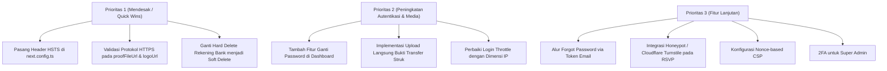

# Laporan Audit Keamanan Dasar (Security Gap Analysis)
**Digital Invitation Builder & Multi-Tier Reseller System**  
*Tanggal Audit: Oktober 2026*  
*Kategori: Analisis Celah Keamanan Dasar, Kepatuhan OWASP, & Rencana Mitigasi*

---

## Ringkasan Eksekutif

Aplikasi telah mengimplementasikan sejumlah kontrol keamanan fondasional yang sangat baik, antara lain:
- **Hashing Password Modern**: Menggunakan algoritma `scrypt` berstandar OWASP dengan *per-user salt* dan perbandingan *constant-time* (`timingSafeEqual`).
- **Sesi Berbasis Database**: Cookie sesi hanya memuat *opaque token* acak, dan database hanya menyimpan SHA-256 hash token tersebut (tidak dapat di-*replay* jika DB bocor).
- **Perlindungan Injeksi**: Penggunaan Drizzle ORM dengan *parameterized queries* mencegah SQL Injection; ketiadaan `dangerouslySetInnerHTML` mencegah XSS berbasis template.
- **Isolasi Multi-Tenant**: Pembatasan data level query per `workspaceId` dan per `resellerId`.

Meskipun demikian, terdapat **beberapa aspek keamanan dasar dan pertahanan mendalam (*defense-in-depth*) yang belum ada atau masih menjadi utang teknis**. Dokumen ini merangkum seluruh temuan tersebut beserta tingkat risikonya dan rekomendasi perbaikannya.

---

## Matriks Temuan Celah Keamanan Dasar

| ID | Kategori | Temuan Celah Keamanan | Tingkat Risiko | Status Saat Ini |
| :--- | :--- | :--- | :---: | :---: |
| **SEC-01** | Autentikasi | Tidak ada alur Lupa Password & Ubah Password mandiri | **SEDANG** | Belum Ada |
| **SEC-02** | Autentikasi | Throttling login belum mendeteksi IP (berisiko DoS & Brute Force) | **SEDANG** | Terbatas (In-Memory) |
| **SEC-03** | Autentikasi | Belum ada Two-Factor Authentication (2FA / OTP) untuk Super Admin | **SEDANG** | Belum Ada |
| **SEC-04** | Header HTTP | Belum ada `Strict-Transport-Security` (HSTS) pada respons | **TINGGI** | Belum Dikonfigurasi |
| **SEC-05** | Header HTTP | `Content-Security-Policy` (CSP) belum aktif | **SEDANG** | Utang Teknis |
| **SEC-06** | Validasi Input | URL Bukti Transfer & Logo Agensi belum dibatasi protokol aman | **SEDANG** | Validasi Longgar |
| **SEC-07** | Media Storage | Bukti transfer masih berupa URL luar (bukan unggah berkas terproteksi) | **SEDANG** | Rentan Hotlink/Manipulasi |
| **SEC-08** | Anti-Abuse | Endpoint RSVP Publik belum memiliki Honeypot / Anti-Bot (Captcha) | **RENDAH** | Hanya IP Rate Limit |
| **SEC-09** | Sesi | Belum ada Idle Session Timeout (Inactivity Logout) untuk Admin | **RENDAH** | Sesi Tetap 7 Hari |
| **SEC-10** | Integritas Data | Penghapusan Rekening Bank Platform masih Hard Delete | **RENDAH** | Berisiko Putus Relasi Riwayat |

---

## Rincian Temuan & Rekomendasi Mitigasi

### 1. [SEC-01] Tidak Ada Fitur Lupa Password & Ubah Password Mandiri
- **Deskripsi Masalah**:
  Saat ini, pembuatan password hanya dilakukan melalui script `seed` atau saat akun klien didaftarkan oleh reseller. Tidak ada form bagi pengguna untuk mengubah kata sandi mereka secara berkala di dashboard, dan tidak ada sistem *Forgot Password* via token reset email satu kali pakai (*time-limited OTP/magic link*).
- **Dampak**:
  Akun rentan terus menggunakan password bawaan dev (`dev-password-change-me`), dan jika pengguna lupa password, admin harus turun tangan mengedit database manual.
- **Rekomendasi**:
  1. Tambahkan menu **"Ganti Kata Sandi"** pada pengaturan akun pengguna di dashboard.
  2. Implementasikan tabel `password_reset_tokens` dengan masa kedaluwarsa 15–30 menit dan single-use flag.

---

### 2. [SEC-02] Throttling Login Belum Mendeteksi IP & Masih In-Memory
- **Deskripsi Masalah**:
  Fungsi `LoginThrottle` saat ini menyimpan kegagalan login di `Map` memori lokal proses Node.js. Pada Server Action `loginAction`, parameter `clientKey` (IP klien) tidak dikirimkan, sehingga kunci throttle hanya berupa `${email}|-`.
- **Dampak**:
  - **Account Lockout DoS**: Penyerang dapat sengaja salah memasukkan password akun pengguna korban sebanyak 5 kali berturut-turut untuk mengunci akun tersebut selama 15 menit.
  - **Distribusi Multi-Instance**: Jika aplikasi di-scale ke beberapa container/server, memori in-memory tidak sinkron.
- **Rekomendasi**:
  1. Teruskan `x-forwarded-for` atau IP klien dari Next.js headers ke fungsi `signIn`.
  2. Pisahkan limitasi: **Maksimal 5 gagal per email** DAN **Maksimal 20 gagal per alamat IP** per jendela 15 menit.
  3. Gunakan Redis atau tabel database untuk throttle login di lingkungan produksi.

---

### 3. [SEC-03] Belum Ada Two-Factor Authentication (2FA) untuk Akun Super Admin
- **Deskripsi Masalah**:
  Akun `owner` (Super Admin) memiliki kuasa mutlak menyetujui mutasi saldo, menerbitkan kuota gratis, dan melihat data seluruh reseller serta rekening bank, namun login hanya dilindungi oleh satu lapis password.
- **Dampak**:
  Jika kredensial admin bocor via phishing atau *credential reuse*, penyerang langsung memiliki akses penuh ke sistem keuangan platform.
- **Rekomendasi**:
  Terapkan 2FA berbasis TOTP (Google Authenticator / Authy) minimal khusus untuk pengguna dengan `systemRole: "owner"`.

---

### 4. [SEC-04] Belum Ada Header `Strict-Transport-Security` (HSTS)
- **Deskripsi Masalah**:
  Pada `next.config.ts`, daftar `SECURITY_HEADERS` telah menyertakan `X-Content-Type-Options`, `X-Frame-Options`, `Permissions-Policy`, dan `Referrer-Policy`, namun header **HSTS** belum dicantumkan.
- **Dampak**:
  Pada jaringan publik (WiFi kafe/hotel), koneksi pengguna rentan terhadap serangan downgrade protokol (SSL Striping) ke HTTP biasa sebelum dialihkan ke HTTPS.
- **Rekomendasi**:
  Tambahkan header berikut untuk rute non-lokal / mode produksi:
  ```ts
  { key: "Strict-Transport-Security", value: "max-age=63072000; includeSubDomains; preload" }
  ```

---

### 5. [SEC-05] `Content-Security-Policy` (CSP) Masih Berstatus Utang Teknis
- **Deskripsi Masalah**:
  Aplikasi belum menerapkan header `Content-Security-Policy`. Di `docs/security-audit.md`, ini dicatat sebagai utang teknis karena Next.js menginjeksi inline script bootstrap yang membutuhkan dukungan nonce atau hash.
- **Dampak**:
  Jika ada kerentanan injeksi XSS dari pustaka pihak ketiga di masa mendatang, browser tidak memiliki pembatasan terhadap domain sumber skrip atau koneksi luar yang dapat dihubungi.
- **Rekomendasi**:
  Gunakan middleware Next.js untuk membuat `nonce` kriptografis per-request dan tetapkan CSP berbasis nonce:
  ```http
  Content-Security-Policy: default-src 'self'; script-src 'self' 'nonce-{random}'; style-src 'self' 'unsafe-inline' fonts.googleapis.com; font-src 'self' fonts.gstatic.com; img-src 'self' data: blob: https:;
  ```

---

### 6. [SEC-06] Validasi URL Bukti Transfer & Logo Agensi Belum Membatasi Protokol Aman
- **Deskripsi Masalah**:
  - Pada pengajuan top-up reseller (`src/app/(dashboard)/dashboard/reseller/topup/actions.ts`), field `proofFileUrl` divalidasi dengan `z.string().url()`.
  - Pada branding agensi (`src/app/(dashboard)/dashboard/reseller/branding/actions.ts`), field `logoUrl` divalidasi dengan `z.string().trim().optional()`.
- **Dampak**:
  Zod bawaan menganggap URL seperti `javascript:alert(1)` atau `data:text/html,...` sebagai URL valid jika tidak difilter protokolnya. Jika URL tersebut dirender sebagai tautan atau gambar tanpa sanitasi, dapat memicu risiko eksekusi skrip atau SSRF.
- **Rekomendasi**:
  Gunakan utilitas `safeUrlSchema` yang sudah ada di `src/lib/schema/url.ts` untuk mewajibkan protokol hanya `https:` pada `proofFileUrl` dan `logoUrl`.

---

### 7. [SEC-07] Bukti Transfer Top-Up Berupa URL Eksternal (Bukan Berkas Terverifikasi)
- **Deskripsi Masalah**:
  Reseller diminta memasukkan link gambar bukti transfer (misal link Imgur, Google Drive, atau hosting luar), alih-alih mengunggah file gambar struk secara langsung ke penyimpanan internal platform.
- **Dampak**:
  1. Reseller dapat mengganti isi gambar di URL eksternal setelah disetujui oleh Owner.
  2. Gambar rentan terhapus di server pihak ketiga sehingga bukti transaksi hilang di kemudian hari.
- **Rekomendasi**:
  Gunakan sistem penyimpanan aset lokal/S3 internal (`src/features/assets`) dengan pembatasan MIME type (JPEG/PNG/WebP), ukuran maksimal 5 MB, dan verifikasi byte-level (*image sniffing*).

---

### 8. [SEC-08] Endpoint RSVP Publik Belum Memiliki Proteksi Bot / Spam (Honeypot/Captcha)
- **Deskripsi Masalah**:
  Endpoint `POST /api/public/rsvp` saat ini dilindungi dengan rate limiter berbasis IP (10 request per menit). Namun, jika bot menggunakan IP berganti-ganti (*residential proxy*), bot dapat mengirimkan ratusan data RSVP atau ucapan spam ke buku tamu mempelai.
- **Dampak**:
  Buku tamu pernikahan menjadi kotor oleh pesan promosi, ujaran kebencian, atau spam otomatis.
- **Rekomendasi**:
  1. Tambahkan teknik **Honeypot field** (input tersembunyi yang tidak terlihat oleh manusia, tetapi jika diisi oleh bot, request langsung ditolak tanpa diproses).
  2. Dukung integrasi Cloudflare Turnstile (non-intrusif) pada form RSVP publik.

---

### 9. [SEC-09] Tidak Ada Idle Session Timeout untuk Sesi Super Admin
- **Deskripsi Masalah**:
  Cookie sesi berlaku tetap selama 7 hari (`SESSION_TTL_MS = 7 * 24 * 60 * 60 * 1000`). Tidak ada pemeriksaan apakah pengguna telah tidak aktif (*idle*) dalam periode waktu tertentu.
- **Dampak**:
  Jika Super Admin login di komputer publik/kantor dan lupa melakukan logout, sesi tetap terbuka dan dapat digunakan oleh orang lain selama 7 hari ke depan.
- **Rekomendasi**:
  Terapkan *sliding window idle timeout* (misal: otomatis kedaluwarsa jika tidak ada request baru dalam 60 menit) khusus untuk sesi Super Admin.

---

### 10. [SEC-10] Rekening Bank Menggunakan Hard Delete
- **Deskripsi Masalah**:
  Fungsi `deleteBankAccount` pada `src/lib/db/repositories/bank-accounts.ts` menghapus baris tabel secara permanen (`db.delete(bankAccounts)`).
- **Dampak**:
  Jika rekening bank dihapus sementara ada riwayat permohonan top-up reseller masa lalu yang merujuk ke rekening tersebut, foreign key referensi akan bernilai `null` sehingga jejak rekening tujuan pada transaksi historis menjadi hilang.
- **Rekomendasi**:
  Hapus opsi hard-delete dan gunakan **Soft Delete** (`isActive: false` atau `deletedAt: timestamp`) agar integritas audit ledger tetap terjaga.

---

## Rencana Aksi Perbaikan Berdasarkan Prioritas


