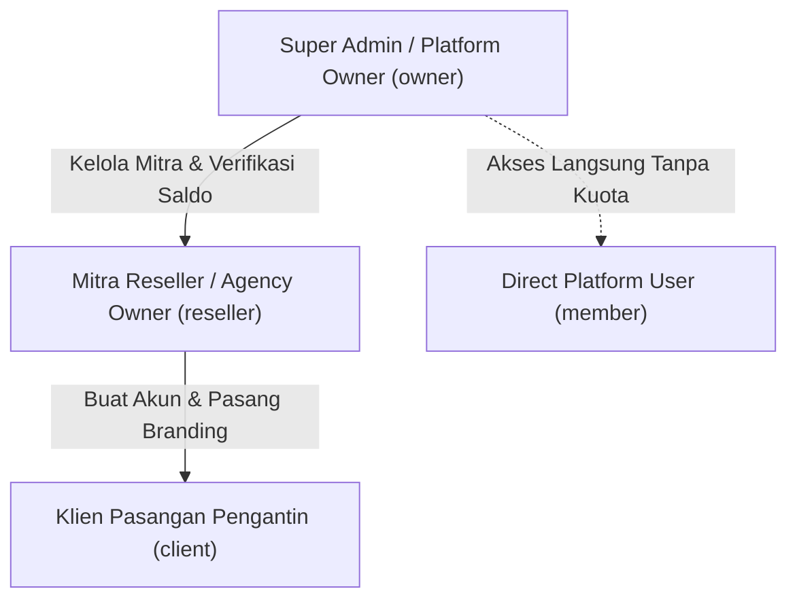

# Panduan Lengkap Halaman Dashboard Aplikasi Digital Invitation Builder

Dokumen ini mendeskripsikan secara menyeluruh setiap rute, antarmuka, hak akses (RBAC), alur kerja, serta fitur yang tersedia pada seluruh halaman dashboard aplikasi.

---

## Daftar Isi
1. [Struktur Peran Pengguna & Hirarki Akses (RBAC)](#1-struktur-peran-pengguna--hirarki-akses-rbac)
2. [Halaman Umum & Klien (Client / Workspace User)](#2-halaman-umum--klien-client--workspace-user)
   - [/dashboard — Ringkasan Workspace](#dashboard--ringkasan-workspace)
   - [/dashboard/templates — Katalog Template](#dashboardtemplates--katalog-template)
   - [/dashboard/templates/[id] — Detail & Penerbitan Template](#dashboardtemplatesid--detail--penerbitan-template)
   - [/editor/[id] — Visual Canvas Editor (Canva-like)](#editorid--visual-canvas-editor-canva-like)
   - [/dashboard/invitations — Daftar Undangan Klien](#dashboardinvitations--daftar-undangan-klien)
   - [/dashboard/invitations/[id] — Detail & Data Mempelai](#dashboardinvitationsid--detail--data-mempelai)
   - [/dashboard/invitations/[id]/preview — Pratinjau Undangan](#dashboardinvitationsidpreview--pratinjau-undangan)
   - [/dashboard/invitations/[id]/rsvp — Manajemen Tamu & RSVP](#dashboardinvitationsidrsvp--manajemen-tamu--rsvp)
3. [Portal Mitra Reseller (/dashboard/reseller/*)](#3-portal-mitra-reseller-dashboardreseller)
   - [/dashboard/reseller — Ringkasan Agensi & Kuota](#dashboardreseller--ringkasan-agensi--kuota)
   - [/dashboard/reseller/topup — Beli Kuota (Top-Up Manual)](#dashboardresellertopup--beli-kuota-top-up-manual)
   - [/dashboard/reseller/transactions — Riwayat & Mutasi Kuota](#dashboardresellertransactions--riwayat--mutasi-kuota)
   - [/dashboard/reseller/clients — Manajemen Klien Agensi](#dashboardresellerclients--manajemen-klien-agensi)
   - [/dashboard/reseller/branding — Kustomisasi White-Label Agensi](#dashboardresellerbranding--kustomisasi-white-label-agensi)
4. [Portal Super Admin / Owner (/dashboard/admin/*)](#4-portal-super-admin--owner-dashboardadmin)
   - [/dashboard/admin/resellers — Manajemen Mitra Reseller](#dashboardadminresellers--manajemen-mitra-reseller)
   - [/dashboard/admin/topup-requests — Verifikasi Top-Up & Rekap Finansial](#dashboardadmintopup-requests--verifikasi-top-up--rekap-finansial)
   - [/dashboard/admin/bank-accounts — Manajemen Rekening Bank Platform](#dashboardadminbank-accounts--manajemen-rekening-bank-platform)
   - [/dashboard/admin/transactions — Audit Ledger Platform](#dashboardadmintransactions--audit-ledger-platform)
5. [Menu Khusus Pengembang (Development Only)](#5-menu-khusus-pengembang-development-only)
   - [/dashboard/playground — Engine Playground](#dashboardplayground--engine-playground)
6. [Tabel Matriks Hak Akses Antar Peran](#6-tabel-matriks-hak-akses-antar-peran)

---

## 1. Struktur Peran Pengguna & Hirarki Akses (RBAC)

Aplikasi menerapkan sistem multi-tenant terisolasi dengan 3 tingkat hak akses (*role*):

1. **Super Admin / Platform Owner (`owner`)**:
   - Memiliki kendali penuh platform, persetujuan transfer pembayaran kuota manual, manajemen rekening pembayaran, serta audit keuangan platform.
2. **Mitra Reseller (`reseller`)**:
   - Agensi pernikahan / digital creator yang membeli kuota grosir (*credit system*), membuat workspace untuk klien mereka, dan menerapkan *white-label branding* agensi sendiri.
3. **Klien Reseller (`client`)**:
   - Pasangan calon pengantin yang terafiliasi dengan agensi reseller tertentu. Mengedit undangan pernikahan mereka sendiri dengan logo dan nama agensi reseller terpampang pada dashboard.

---

## 2. Halaman Umum & Klien (Client / Workspace User)

### `/dashboard` — Ringkasan Workspace
- **Akses**: Semua Pengguna yang Terotentikasi.
- **Tujuan**: Halaman beranda utama yang memberikan ringkasan status operasional undangan dan template di workspace aktif saat ini.
- **Fitur Utama**:
  - **Banner Branding Agensi**: Jika pengguna adalah klien reseller, bagian atas dashboard secara otomatis menampilkan logo, nama agensi, dan tombol WhatsApp kontak bantuan dari reseller yang menaunginya.
  - **Kartu Metrik Singkat**: Menampilkan jumlah total template, undangan yang sedang disusun (*draft*), dan undangan yang sudah berstatus aktif/terbit (*published*).
  - **Langkah Kerja (Quick Start Guide)**: Petunjuk alur kerja interaktif mulai dari memilih template, melengkapi data mempelai, hingga menerbitkan tautan undangan.

---

### `/dashboard/templates` — Katalog Template
- **Akses**: Semua Pengguna yang Terotentikasi.
- **Tujuan**: Menampilkan seluruh pustaka desain template undangan pernikahan yang dapat diduplikasi atau diedit.
- **Fitur Utama**:
  - **Daftar Kartu Desain**: Menampilkan *thumbnail*, judul, kategori tema (elegan, modern, floral, adat), dan status publikasi masing-masing template.
  - **Filter & Pencarian**: Memfilter template berdasarkan tema atau status (*draft* vs *published*).
  - **Aksi Cepat**: Tombol **"Buka Editor"** untuk mendesain di kanvas dan tombol **"Gunakan Desain"** untuk menduplikasi template menjadi undangan baru.

---

### `/dashboard/templates/[id]` — Detail & Penerbitan Template
- **Akses**: Pemilik Workspace / Pembuat Template.
- **Tujuan**: Mengelola metadata, struktur variabel data dinamis, dan kontrol versi template.
- **Fitur Utama**:
  - **Inspeksi Variabel Binding**: Meninjau variabel data dinamis yang digunakan pada template (misal: nama mempelai pria, nama mempelai wanita, tanggal akad, lokasi resepsi).
  - **Validasi Skema Dokumen**: Tombol validasi apakah susunan layout dan format JSON dokumen memenuhi standar engine undangan.
  - **Penerbitan Template**: Mengubah status template menjadi *published* agar siap digunakan untuk membuat undangan massal.

---

### `/editor/[id]` — Visual Canvas Editor (Canva-like)
- **Akses**: Pemilik Template / Undangan yang sedang diedit.
- **Tujuan**: Studio kanvas grafis interaktif bebas kode (*drag-and-drop*) untuk merancang layout undangan mobile.
- **Fitur Utama**:
  - **Artboard Mobile Responsive**: Kanvas 9:16 mobile viewport dengan pembagian *section* (Cover, Profil Mempelai, Acara Akad/Resepsi, Cerita Cinta, Galeri, dsb.).
  - **Panel Layer & Elemen**: Menambah teks tipografi, foto galeri, ornamen/bingkai, musik latar belakang, animasi masuk GSAP, dan transisi antar-seksi.
  - **Inspector Toolbar**: Mengatur font Google Fonts, warna palet HSL/Hex, efek bayangan (*shadow*), rotasi, transparansi (*opacity*), dan cropping gambar.
  - **Data-Binding Engine**: Menghubungkan elemen teks tertentu dengan variabel sistem (contoh: teks langsung terhubung ke `{couple.groom.fullName}`).

---

### `/dashboard/invitations` — Daftar Undangan Klien
- **Akses**: Semua Pengguna yang Terotentikasi.
- **Tujuan**: Mengelola portofolio seluruh undangan digital pasangan yang telah dibuat di dalam workspace.
- **Fitur Utama**:
  - **Tabel Daftar Undangan**: Memuat judul undangan, slug URL publik, nama pasangan mempelai, dan badge status (*Draft*, *Ready*, *Published*).
  - **Tombol "Buat Undangan Baru"**: Alur pembuatan undangan baru berbasis template yang sudah ada.
  - **Navigasi Langsung**: Tautan cepat untuk membuka visual editor, membuka konfigurasi tamu/RSVP, atau melihat halaman live publik.

---

### `/dashboard/invitations/[id]` — Detail & Data Mempelai
- **Akses**: Pemilik Undangan / Klien Bersangkutan.
- **Tujuan**: Formulir terstruktur pengisian konten utama pernikahan tanpa perlu membuka kanvas visual.
- **Fitur Utama**:
  - **Form Data Mempelai Pria & Wanita**: Nama lengkap, nama panggilan, nama orang tua, akun media sosial, dan foto profil.
  - **Form Rangkaian Acara**: Waktu & tanggal akad nikah, resepsi, countdown timer, nama gedung/venue, alamat lengkap, dan embed Google Maps.
  - **Pengaturan URL Publik (Slug)**: Menyesuaikan tautan undangan (contoh: `/u/rama-shinta`).
  - **Penerbitan Undangan (Publishing)**:
    - *Bagi Klien Reseller*: Sistem memvalidasi saldo kuota reseller agensi induk. Jika kuota mencukupi, sistem memotong **1 Kredit Kuota** secara atomik dan menerbitkan undangan.
    - *Bagi Direct Platform User*: Undangan langsung terbit tanpa pemotongan kuota.

---

### `/dashboard/invitations/[id]/preview` — Pratinjau Undangan
- **Akses**: Pemilik Undangan.
- **Tujuan**: Memeriksa tampilan akhir undangan tepat seperti yang akan dilihat oleh tamu undangan pada smartphone sebelum tautan dibagikan.
- **Fitur Utama**:
  - **Mobile Frame Simulator**: Menampilkan hasil render HTML DOM murni dengan animasi seksi, transisi layar buka (*opening screen*), tombol interaktif buka undangan, dan audio player musik otomatis.

---

### `/dashboard/invitations/[id]/rsvp` — Manajemen Tamu & RSVP
- **Akses**: Pemilik Undangan.
- **Tujuan**: Pusat pengelolaan daftar tamu undangan, pembagian sesi kehadiran, pembuatan link personalisasi nama tamu, serta rekap konfirmasi kehadiran dan ucapan.
- **Fitur Utama**:
  - **Daftar Tamu & Personalisasi URL**: Menghasilkan tautan unik per tamu (contoh: `/u/rama-shinta?to=Budi+Santoso`).
  - **Fitur Impor CSV Tamu**: Upload file CSV nama tamu massal dengan pendeteksi duplikasi otomatis.
  - **Rekapitulasi Kehadiran (RSVP)**: Statistik jumlah tamu yang Hadir, Ragu-ragu, dan Tidak Hadir beserta jumlah anggota rombongan (*pax*).
  - **Buku Tamu & Ucapan Doa**: Moderasi ucapan selamat dan doa restu yang dikirimkan oleh para tamu melalui halaman undangan publik.

---

## 3. Portal Mitra Reseller (`/dashboard/reseller/*`)

Menu ini khusus ditampilkan bagi pengguna dengan peran `reseller`.

### `/dashboard/reseller` — Ringkasan Agensi & Kuota
- **Akses**: Khusus Mitra Reseller.
- **Tujuan**: Dasbor eksekutif untuk memantau performa agensi, saldo kuota yang tersisa, dan aktivitas klien.
- **Fitur Utama**:
  - **Widget Saldo Kuota**: Menampilkan sisa kredit undangan aktif dengan indikator peringatan jika kuota menipis.
  - **Metrik Performa**: Jumlah total klien terdaftar, jumlah undangan yang berhasil dipublikasikan, dan total permohonan top-up.
  - **Aksi Cepat Reseller**: Tombol instan ke menu *Beli Kuota*, *Tambah Klien*, dan *Atur Branding Agensi*.

---

### `/dashboard/reseller/topup` — Beli Kuota (Top-Up Manual)
- **Akses**: Khusus Mitra Reseller.
- **Tujuan**: Pembelian paket kuota grosir sistem manual transfer tanpa payment gateway pihak ketiga.
- **Fitur Utama**:
  - **Informasi Rekening Resmi Platform**: Menampilkan daftar rekening bank milik Super Admin / Owner (BCA, Mandiri, BRI, BSI) lengkap dengan nomor rekening, atas nama, dan kode QRIS.
  - **Pilihan Paket Kuota**: Pilihan paket kredit fleksibel (contoh: 10, 25, 50, atau 100 kredit undangan).
  - **Formulir Pengajuan Transfer**: Input nominal transfer, bank pengirim, nama rekening pengirim, dan unggah file struk/bukti transfer.
  - **Tombol Instan Konfirmasi WhatsApp**: Setelah formulir terkirim, tombol **"💬 Konfirmasi via WhatsApp Sekarang"** otomatis muncul untuk mengirimkan pesan konfirmasi berformat resmi ke nomor Owner platform secara langsung.

---

### `/dashboard/reseller/transactions` — Riwayat & Mutasi Kuota
- **Akses**: Khusus Mitra Reseller.
- **Tujuan**: Transparansi buku kas kuota kredit reseller dan pelacakan status pengajuan top-up.
- **Fitur Utama**:
  - **Status Permohonan Top-Up**: Daftar permohonan dengan status *Pending (Menunggu Review)*, *Approved (Disetujui)*, atau *Rejected (Ditolak beserta alasan penolakan)*.
  - **Tombol Konfirmasi Ulang WhatsApp**: Tombol aksi cepat untuk mem-follow up pengajuan yang masih berstatus pending ke nomor Owner.
  - **Buku Ledger Kredit**: Riwayat setiap kredit yang masuk (*owner_grant*, *topup*) dan kredit yang keluar (*invitation_publish* mencantumkan ID undangan terkait).
  - **Ekspor CSV**: Mengunduh seluruh riwayat permohonan dan mutasi kredit ke file CSV berstandar RFC 4180 dengan UTF-8 BOM untuk Microsoft Excel.

---

### `/dashboard/reseller/clients` — Manajemen Klien Agensi
- **Akses**: Khusus Mitra Reseller.
- **Tujuan**: Mendaftarkan akun pasangan pengantin di bawah naungan agensi reseller.
- **Fitur Utama**:
  - **Form Tambah Klien**: Membuat akun klien baru (Nama Klien, Email, Password awal) yang secara otomatis membuatkan workspace terisolasi berelasi ke reseller bersangkutan.
  - **Tabel Klien Agensi**: Daftar seluruh pasangan yang dinaungi beserta tanggal pendaftaran dan status undangan mereka.
  - **Isolasi Data Multi-Tenant**: Reseller hanya dapat melihat klien miliknya sendiri; data antar-reseller diproteksi secara ketat.

---

### `/dashboard/reseller/branding` — Kustomisasi White-Label Agensi
- **Akses**: Khusus Mitra Reseller.
- **Tujuan**: Menghilangkan atribusi platform utama dan menggantinya dengan identitas agensi milik reseller.
- **Fitur Utama**:
  - **Pengaturan Nama Brand Agensi**: Mengganti nama yang muncul di header dashboard klien.
  - **Unggah Logo Agensi**: Menampilkan logo agensi pada bilah navigasi dan kartu informasi klien.
  - **Nomor Kontak WhatsApp Layanan Pelanggan**: Nomor kontak yang akan dihubungi oleh klien jika mereka membutuhkan bantuan saat menyusun undangan.

---

## 4. Portal Super Admin / Owner (`/dashboard/admin/*`)

Menu ini khusus ditampilkan bagi pengguna dengan peran platform `owner`.

### `/dashboard/admin/resellers` — Manajemen Mitra Reseller
- **Akses**: Khusus Super Admin / Owner.
- **Tujuan**: Mengelola kemitraan B2B dengan seluruh agensi reseller undangan.
- **Fitur Utama**:
  - **Daftar Seluruh Agensi**: Tabel interaktif mencantumkan nama agensi, nama pemilik, email login, nomor kontak WhatsApp, sisa saldo kuota kredit, dan status keaktifan.
  - **Tombol Tambah Mitra Reseller**: Formulir pendaftaran mitra baru lengkap dengan alokasi saldo kredit awal.
  - **Penyesuaian Kuota (Manual Credit Adjustment)**: Tombol untuk menambah (*grant*) atau mengoreksi kuota reseller secara langsung beserta catatan mutasi.
  - **Toggle Status Akun**: Mengaktifkan atau menonaktifkan (*suspend*) akses agensi tertentu.

---

### `/dashboard/admin/topup-requests` — Verifikasi Top-Up & Rekap Finansial
- **Akses**: Khusus Super Admin / Owner.
- **Tujuan**: Verifikasi transaksi transfer manual dari para mitra reseller dan monitoring analitik keuangan platform.
- **Fitur Utama**:
  - **Kartu Analitik Finansial (Financial Recap Cards)**:
    - *Dana Masuk (Disetujui)*: Akumulasi nominal rupiah yang sah masuk ke kas platform.
    - *Menunggu Verifikasi*: Akumulasi nominal rupiah dari pengajuan yang sedang antre.
    - *Total Permohonan*: Jumlah akumulasi permohonan (Approved, Pending, Rejected).
  - **Filter Status Cepat**: Tab filter *Semua*, *Menunggu Verifikasi*, *Disetujui*, dan *Ditolak*.
  - **Modal Tinjau Bukti Struk**: Klik thumbnail bukti transfer untuk membuka gambar beresolusi penuh untuk pencocokan mutasi bank.
  - **Aksi Setujui / Tolak**:
    - *Setujui (Approve)*: Menambahkan kuota kredit ke reseller secara atomik, mencatat ledger mutasi, dan memperbarui status menjadi disetujui.
    - *Tolak (Reject)*: Membatalkan permohonan dengan kolom wajib menyertakan alasan penolakan (misal: "Struk tidak valid / dana belum masuk").
  - **Ekspor CSV**: Mengunduh seluruh rekapitulasi permohonan top-up ke file spreadsheet CSV.

---

### `/dashboard/admin/bank-accounts` — Manajemen Rekening Bank Platform
- **Akses**: Khusus Super Admin / Owner.
- **Tujuan**: Mengatur daftar rekening bank tujuan transfer yang tampil pada halaman top-up reseller.
- **Fitur Utama**:
  - **Tambah Rekening Bank Baru**: Input nama bank (BCA, Mandiri, BRI, BNI, BSI, Jago, dll.), nomor rekening, dan nama pemilik rekening (*account holder*).
  - **Upload Gambar QRIS & Petunjuk Transfer**: Mendukung metode pembayaran QRIS statis dan panduan instruksi transfer.
  - **Toggle Status Aktif / Nonaktif**: Mengontrol rekening mana saja yang sedang menerima pembayaran tanpa perlu menghapus riwayat rekening lama.

---

### `/dashboard/admin/transactions` — Audit Ledger Platform
- **Akses**: Khusus Super Admin / Owner.
- **Tujuan**: Audit trail menyeluruh dan kepatuhan finansial atas seluruh mutasi kuota di level sistem.
- **Fitur Utama**:
  - **Tabel Mutasi Global**: Mencatat setiap transaksi kredit platform: tanggal transaksi, nama agensi, tipe mutasi (`purchase_topup`, `owner_grant`, `invitation_publish`, `refund`), perubahan saldo (*balance before* → *balance after*), ID referensi permohonan, dan aktor yang mengeksekusi.
  - **Pencarian & Audit**: Menelusuri histori pemotongan kuota per undangan atau per agensi.
  - **Ekspor CSV Audit Ledger**: Mengunduh seluruh jurnal transaksi kuota platform ke file CSV berstandar RFC 4180.

---

## 5. Menu Khusus Pengembang (Development Only)

### `/dashboard/playground` — Engine Playground
- **Akses**: Otomatis aktif pada mode development (`NODE_ENV !== "production"`).
- **Tujuan**: Tempat pengujian visual interaktif untuk memverifikasi bagaimana skema JSON variabel dinamis diinjeksikan ke dalam engine template undangan secara real-time.
- **Fitur Utama**:
  - Panel editor JSON input data mentah di sebelah kiri.
  - Panel render engine di sebelah kanan untuk mengevaluasi formatting tanggal, nama variabel binding, dan error fallback secara langsung.

---

## 6. Tabel Matriks Hak Akses Antar Peran

| Halaman Dashboard | Path URL | Klien (`client`) | Mitra Reseller (`reseller`) | Super Admin (`owner`) |
| :--- | :--- | :---: | :---: | :---: |
| **Ringkasan Workspace** | `/dashboard` | ✅ *(White-label)* | ✅ | ✅ |
| **Katalog Template** | `/dashboard/templates` | ✅ | ✅ | ✅ |
| **Detail & Konfigurasi Template** | `/dashboard/templates/[id]` | ✅ | ✅ | ✅ |
| **Visual Canvas Editor** | `/editor/[id]` | ✅ | ✅ | ✅ |
| **Daftar Undangan** | `/dashboard/invitations` | ✅ | ✅ | ✅ |
| **Data Mempelai & Penerbitan** | `/dashboard/invitations/[id]` | ✅ *(Potong 1 Kuota)* | ✅ *(Potong 1 Kuota)* | ✅ *(Bebas Kuota)* |
| **Pratinjau Undangan** | `/dashboard/invitations/[id]/preview` | ✅ | ✅ | ✅ |
| **Manajemen Tamu & RSVP** | `/dashboard/invitations/[id]/rsvp` | ✅ | ✅ | ✅ |
| **Ringkasan Agensi & Kuota** | `/dashboard/reseller` | ❌ *(Redirect)* | ✅ | ❌ *(Redirect)* |
| **Beli Kuota (Top-Up Manual)** | `/dashboard/reseller/topup` | ❌ *(Redirect)* | ✅ | ❌ *(Redirect)* |
| **Riwayat Transaksi Reseller** | `/dashboard/reseller/transactions` | ❌ *(Redirect)* | ✅ | ❌ *(Redirect)* |
| **Manajemen Klien Agensi** | `/dashboard/reseller/clients` | ❌ *(Redirect)* | ✅ | ❌ *(Redirect)* |
| **Kustomisasi Branding Agensi** | `/dashboard/reseller/branding` | ❌ *(Redirect)* | ✅ | ❌ *(Redirect)* |
| **Manajemen Mitra Reseller** | `/dashboard/admin/resellers` | ❌ *(Redirect)* | ❌ *(Redirect)* | ✅ |
| **Verifikasi Top-up & Rekap** | `/dashboard/admin/topup-requests` | ❌ *(Redirect)* | ❌ *(Redirect)* | ✅ |
| **Rekening Bank Platform** | `/dashboard/admin/bank-accounts` | ❌ *(Redirect)* | ❌ *(Redirect)* | ✅ |
| **Audit Ledger Platform** | `/dashboard/admin/transactions` | ❌ *(Redirect)* | ❌ *(Redirect)* | ✅ |
| **Engine Playground** | `/dashboard/playground` | Dev Only | Dev Only | Dev Only |
